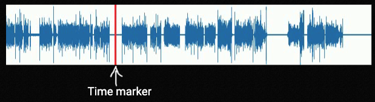

# waveform_video_generator

Tool for generating audio waveform progress video

## Installation

This can be installed directly from github by the following command:

```
pip install --user git+https://github.com/stakita/waveform_video_generator
```

## Installed components

This package installs one command line tool `create_waveform_video.py` which can be invoked by running:

```
$ create_waveform_video --help
create_waveform_video.py
Generate audio waveform progress video.

Usage:
  create_waveform_video.py <input_media_file> <total_seconds> [--output=<OUTPUT_FILE>] [--width=<WIDTH>] [--height=<HEIGHT>] [--channels=<CHANNELS>] [--fps=<FPS>]
  create_waveform_video.py (-h | --help)

Options:
  -h --help                 Show this screen.
  --output=<OUTPUT_FILE>    Output file name [default: waveform.mp4]
  --width=<WIDTH>           Width of the image [default: 2262]
  --height=<HEIGHT>         Width of the image [default: 200]
  --channels=<CHANNELS>     Set mono(1) or stereo(2) [default: 1]
  --fps=<FPS>               Override frames per second [default: 24]
```

This tool will generate a 2-dimensional waveform of the input audio file and package it into a video where the marker indicates the current time within the waveform:


